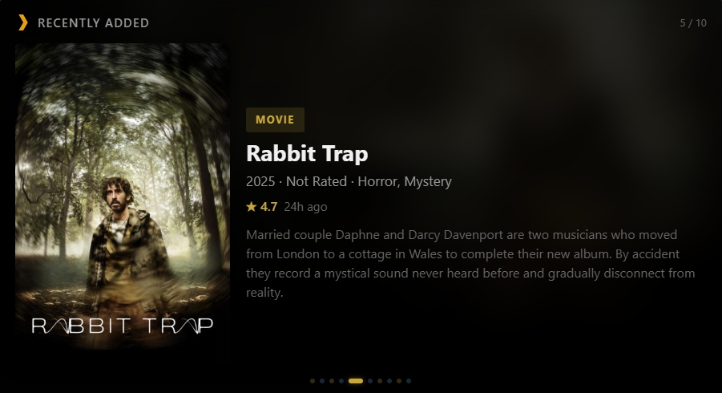

# Plex Now Showing — Home Assistant Package

A cinema-style "Now Showing" marquee display and a Plex Recently Added dashboard card for Home Assistant. These are two independent components — you can use either one on its own, or both together.


## Screenshots

<p align="center">
  
  &nbsp;&nbsp;&nbsp;
  
</p>

---

# 1. Now Showing — Cinema Marquee Display

A full-screen cinema marquee page that displays what's currently playing on Plex. Features animated chase bulb lights, a red curtain banner, and poster art with title overlays. Designed for wall-mounted tablets.

### What You Need

- **Home Assistant** with the [Plex integration](https://www.home-assistant.io/integrations/plex/) configured
- A **Plex Media Server** on your local network
- **Fully Kiosk Browser** (optional) — for automatic switching between your dashboard and the Now Showing page

### Files

| File | Description |
|------|-------------|
| `www/now_showing.html` | The full-screen marquee page |
| `automations/plex_now_showing_display.yaml` | Automation to auto-switch a tablet when playback starts/stops |

### Setup

**Step 1 — Copy the file**

Place `www/now_showing.html` into your Home Assistant `www` directory:

```
<config>/www/now_showing.html
```

You can do this via the **File Editor** add-on, **Samba**, **SSH**, or the **VS Code** add-on.

**Step 2 — Configure your credentials**

Open `now_showing.html` and update these values near the top of the `<script>` section:

```javascript
const HA_URL = 'http://YOUR_HA_IP:8123';           // Your Home Assistant URL
const HA_TOKEN = 'YOUR_LONG_LIVED_ACCESS_TOKEN';    // HA long-lived access token
const PLEX_USERNAME = 'your_plex_username';          // Your Plex username (filters to only your playback)
```

To create a long-lived access token:
1. Go to your HA profile (click your name in the sidebar)
2. Scroll to "Long-Lived Access Tokens"
3. Click "Create Token", give it a name, and copy the token

**Step 3 — Open it**

Navigate to `http://YOUR_HA_IP:8123/local/now_showing.html` in a browser to test it. If Plex is playing something, you should see the poster appear.

**Step 4 (Optional) — Set up the automation**

If you want a Fully Kiosk Browser tablet to automatically switch to the Now Showing page when playback starts:

1. Copy the contents of `automations/plex_now_showing_display.yaml` into your `automations.yaml` file, or recreate it through the HA UI
2. Update the following values in the automation:

| What to change | Where in the file | How to find yours |
|---|---|---|
| **Plex session sensor** | `entity_id: sensor.tnas` (appears 3 times — trigger + 2 conditions) | Go to **Developer Tools → States**, search for your Plex server name. Look for a `sensor.*` entity that shows the number of active sessions (e.g., `sensor.plex_myserver`, `sensor.tnas`). Its state will be a number like `0` or `1`. |
| **Fully Kiosk device ID** | `device_id: YOUR_FULLY_KIOSK_DEVICE_ID` (appears 2 times) | Go to **Settings → Devices**, find your Fully Kiosk tablet, and copy the device ID from the URL (the long string after `/device/`). |
| **Now Showing URL** | `url:` in the first action | Change to `http://YOUR_HA_IP:8123/local/now_showing.html` |
| **Dashboard URL** | `url:` in the second action | Change to the URL of the dashboard you want to return to after playback stops (e.g., `http://YOUR_HA_IP:8123/lovelace/0`). |

### How It Works

- Polls Home Assistant's API every 5 seconds for active Plex `media_player` entities
- Filters to only your user's playback sessions
- Displays the current media's poster art as a full-bleed background
- Shows title, episode info (for TV), and playback state
- When nothing is playing, shows an idle "Waiting for playback" state
- The automation triggers when `sensor.tnas` (Plex session count) changes — it waits 5 seconds then loads the page, or waits 10 seconds after playback stops to return to your dashboard

### Customization

| Setting | Where | Default |
|---------|-------|---------|
| Poll interval | `POLL_INTERVAL` in script | 5000ms (5 seconds) |
| Plex username filter | `PLEX_USERNAME` in script | Your Plex username |
| Marquee text size | `.marquee-text h1` font-size in CSS | `clamp(3.5rem, 10vw, 8rem)` |
| Bulb size | `.bulb` width/height in CSS | 28px |
| Bulb spacing | `spacing` in `createOuterBulbs()` | 42px |
| Chase animation speed | `setInterval(animateChase, ...)` | 500ms |

---

# 2. Recently Added — Plex Dashboard Card

A custom Lovelace card that shows the 5 most recently added movies and 5 most recently added TV shows from Plex, with interleaved cycling, poster art, blurred background art, synopsis, and ratings.

### What You Need

- **Home Assistant**
- A **Plex Media Server** on your local network
- Your **Plex token**

### Files

| File | Description |
|------|-------------|
| `www/plex-recently-added-card.js` | The custom Lovelace card |

### Install via HACS (Recommended)

1. Open **HACS** in Home Assistant
2. Click the three dots (top right) → **Custom repositories**
3. Enter `https://github.com/rusty4444/plex-now-showing` and select **Dashboard** as the category
4. Click **Add**
5. Search for "Plex Now Showing" in HACS and click **Install**
6. Restart Home Assistant

The Lovelace resource will be registered automatically.

### Install Manually (Alternative)

1. Download `plex-recently-added-card.js` from the [latest release](https://github.com/rusty4444/plex-now-showing/releases/latest)
2. Place it in your `<config>/www/` directory
3. Go to **Settings → Dashboards** → three dots (top right) → **Resources**
4. Click **Add Resource**
5. URL: `/local/plex-recently-added-card.js`
6. Type: **JavaScript Module**

### Add the card to a dashboard

In your dashboard, add a **Manual card** with this YAML:

```yaml
type: custom:plex-recently-added-card
plex_url: http://YOUR_PLEX_IP:32400
plex_token: YOUR_PLEX_TOKEN
movies_count: 5
shows_count: 5
cycle_interval: 8
title: Recently Added
```

For best results, set the card to span the full width of a section and give it plenty of vertical space (e.g., 8+ grid rows).

**To find your Plex token:**
1. Sign in to Plex Web App
2. Browse to any media item
3. Click "Get Info" → "View XML"
4. The token is in the URL as `X-Plex-Token=XXXXX`

### How It Works

- Connects directly to your Plex server's API
- Fetches the latest movies and TV shows from all libraries
- Deduplicates TV shows (only shows the most recent entry per series)
- Interleaves movies and TV shows for variety (movie, show, movie, show...)
- Auto-cycles through items with smooth background transitions
- Color-coded dots indicate movie (gold) vs TV (blue)

### Customization

| Setting | In card YAML | Default |
|---------|-------------|---------|
| `movies_count` | Number of movies to show | 5 |
| `shows_count` | Number of TV shows to show | 5 |
| `cycle_interval` | Seconds between items | 8 |
| `title` | Header text (set to empty string to hide) | "Recently Added" |

---

## Troubleshooting

**Now Showing**
- **Blank poster**: Check that your HA token is valid and the Plex `entity_picture` URLs are accessible
- **Only seeing other users' playback**: Update `PLEX_USERNAME` in `now_showing.html` to match your Plex username
- **Automation not triggering**: Verify your Plex session count sensor exists and changes value when playback starts/stops

**Recently Added Card**
- **Card not appearing**: Make sure the Lovelace resource is registered and clear your browser cache (or append `?v=2` to the resource URL)
- **No items showing**: Double-check your `plex_url` and `plex_token` — the card connects directly to Plex, not through HA

---

## Credits

Built by Sam Russell — AI used in development.
Built with Home Assistant, Plex, and Fully Kiosk Browser.
