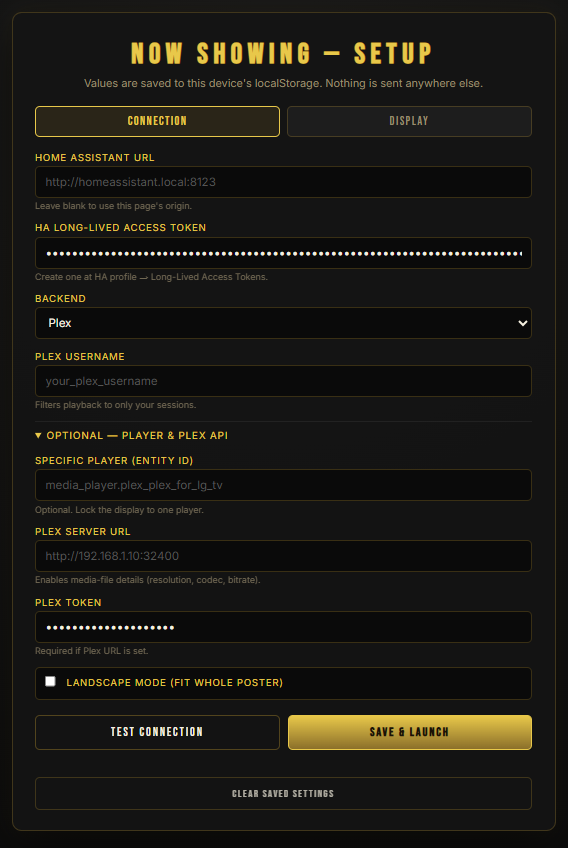
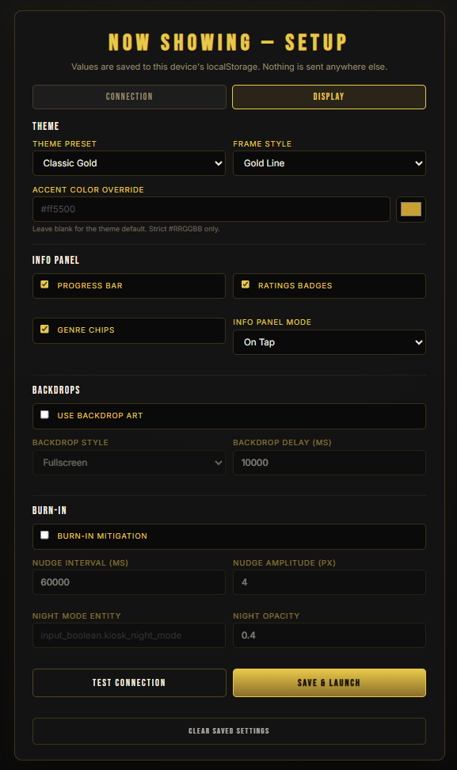

# "Now Showing" Home Assistant Addon

<p align="center">
  <a href="https://buymeacoffee.com/rusty4" target="_blank">
    
  </a>
</p>

> This README describes Plex Now Showing v2.1.0. This release builds on the
> v2.0.0 add-on/Docker foundation with Coming Soon mode, more player
> backends, a broader setup UI, and more visual controls.

A full-screen cinema marquee display for Home Assistant that shows what is
currently playing on Plex, Jellyfin, Emby, Kodi, Apple TV, generic streaming
devices, or Kaleidescape.
It is designed for wall-mounted tablets running Fully Kiosk Browser, but it
also works in any modern browser.

V2.1 keeps the cinema-marquee feel while making the display easier to run as a
Home Assistant add-on, Docker service, frontend-only page, live Now Showing
kiosk, or Radarr/Sonarr-powered Coming Soon screensaver.


<p align="center">
  
  &nbsp;&nbsp;
  
</p>

<p align="center">
  
  &nbsp;&nbsp;
  
</p>

<p align="center">
  
</p>

## Install Paths

| Path | Best for | Secret handling | Start here |
|------|----------|-----------------|------------|
| Home Assistant add-on | HA OS / Supervised | Uses Supervisor token server-side; no HA long-lived token in the browser | Add the repo in the Add-on Store and open the add-on Web UI |
| Docker Compose | HA Container / plain Docker | Uses `HA_URL` + `HA_TOKEN` from `.env`; tokens stay server-side | `docker/.env.example` + `docker/docker-compose.example.yml` |
| Frontend-only / manual | HACS-style or copy-to-`www` installs | Uses local device storage, hash config, or `now_showing.config.js` | Copy `www/now_showing.html` into Home Assistant `www` |

All three paths use the same kiosk UI. The add-on and Docker paths add the
Node server that proxies Home Assistant and Plex metadata so API tokens are
not exposed to the tablet browser.

## What's Changed From V2.0.0 To V2.1.0

V2.1.0 is the "wall display polish" release. It keeps the v2.0.0 server,
add-on, Docker, and frontend-only install paths, then adds the next layer of
real-world kiosk features:

| Area | V2.1.0 change |
|------|---------------|
| More playback sources | Apple TV, generic streaming-device, and Kaleidescape backends join Plex, Jellyfin, Emby, and Kodi. Apple TV / streaming mode can use Home Assistant `app_name`, `media_title`, `entity_picture`, and dashboard-icons app badges for Disney+, YouTube, Netflix, Plex, Hulu, Prime Video, and similar apps. |
| Coming Soon screensaver | New `coming_soon` display mode rotates upcoming Radarr/Sonarr movies and episodes with configurable marquee text, movie/show counts, cycle interval, days offset, and poster/fanart artwork. |
| Setup UI | The setup flow now has player loading/picking, backend-specific player hints, Coming Soon source fields, Fully Kiosk automation helpers, a wider live visual preview in the Display tab, a corrected bulb-frame preview, and fixed scrolling inside Home Assistant add-on Ingress views. |
| Visual controls | Frame style, bulb size, marquee font, theme preset, accent color, marquee background color, corner radius, progress bar, ratings badges, genre chips, info-panel mode, backdrops, burn-in nudge, and night dimming are configurable from setup without editing the HTML. |
| Now Showing + Coming Soon together | The docs now cover running two display URLs/instances so Fully Kiosk can show Now Showing during playback and Coming Soon as the idle/screensaver view. |
| Release package | The Home Assistant add-on package and Node server package are versioned at `2.1.0`, with Docker/add-on release docs updated for the `addon-v2.1.0` package flow. |

## Features

- Cinema marquee display with animated bulb frame, title overlays, idle state,
  and portrait or landscape layouts.
- Playback support for Plex, Jellyfin, Emby, Kodi, Apple TV, generic
  streaming devices, and Kaleidescape Home Assistant `media_player` entities.
- Streaming app-name badges with app icons when Home Assistant exposes
  `app_name`, including Disney+, YouTube, Netflix, Plex, and similar apps.
- Coming Soon mode for Radarr/Sonarr upcoming movies and episodes, with
  rotating poster or fanart art for Fully Kiosk screensavers and automations.
- Optional exact player pinning via `player`.
- Plex username filtering so shared Plex servers can show only your sessions.
- Tap-for-info panel with synopsis, player, rating, duration, progress, and
  Plex media-file details when `plex_url` + `plex_token` are configured.
- Optional progress bar driven by Home Assistant `media_position`.
- Optional IMDb / Rotten Tomatoes / audience badges and genre chips from Plex
  metadata.
- Optional info-panel modes: `on_tap`, `on_pause`, or `always`.
- Optional backdrop art on pause, either fullscreen landscape fade or ambient
  blurred fanart.
- Optional OLED-friendly burn-in mitigation with pixel nudge and night-mode
  dimming.
- Theme presets: `classic-gold`, `art-deco-silver`, `neon-80s`, and
  `minimalist-dark`.
- Strict `#RRGGBB` accent color override that reskins the active theme.
- Strict `#RRGGBB` marquee background color override, with setup presets for
  black, deep red, navy, forest green, midnight purple, and charcoal.
- Optional corner-radius slider for the inner marquee, poster, and info panel.
- Frame style picker: animated `bulbs`, quiet `gold-line`, or `none`.
- Bulb size slider for the animated bulb frame.
- Marquee font picker: `bebas-neue`, `anton`, `oswald`, `monoton`, or
  `playfair-display`.
- Optional Fully Kiosk Browser auto-switching between your dashboard and the
  Now Showing page.
- Setup Automation tab with Blueprint import/download links and a built-in
  Fully Kiosk switcher config helper.
- Setup page scrolling is fixed for Home Assistant add-on Ingress, including
  tall setup tabs that previously opened with the top controls cut off.

## Requirements

- Home Assistant with at least one supported media integration configured:
  Plex, Jellyfin, Emby, Kodi, Apple TV, a streaming device exposing
  `app_name`, or Kaleidescape.
- One or more active `media_player` entities from that integration.
- Radarr or Sonarr URL + API key if you want `display_mode: coming_soon`.
- Fully Kiosk Browser if you want automatic wall-tablet switching.
- Plex URL + Plex token only if you want Plex-only enhanced metadata such as
  codec/HDR details, ratings, genre chips, or Plex backdrop art.

## Setup A: Home Assistant Add-on

Use this path for HA OS or HA Supervised. It is the recommended V2 install
because Home Assistant Supervisor supplies the API token automatically.

1. Open Home Assistant.
2. Go to **Settings -> Add-ons -> Add-on Store -> ... -> Repositories**.
3. Add this repository URL:

   ```text
   https://github.com/rusty4444/now-showing-ha
   ```

   While testing the `dev` branch before it is promoted to `main`, use the
   branch-suffixed repository URL:

   ```text
   https://github.com/rusty4444/now-showing-ha#dev
   ```

   Home Assistant supports the `#branch` suffix for stable/canary add-on
   repositories:
   https://developers.home-assistant.io/docs/add-ons/presentation/#offering-stable-and-canary-version

4. Install **Now Showing**.
5. Configure the add-on:
   - `backend`: `plex`, `jellyfin`, `emby`, `kodi`, `apple_tv`, `streaming`, or
     `kaleidescape`
   - `player`: optional exact entity ID, for example `media_player.kodi`
   - `plex_url` and `plex_token`: optional, Plex enhanced metadata only
   - visual options such as `visual_theme`, `visual_frame_style`,
     `visual_bulb_size_px`, `visual_marquee_font`,
     `visual_marquee_bg_color`, and `visual_progress_bar`
6. Start the add-on.
7. Click **Open Web UI** for Ingress, or open:

   ```text
   http://<ha-ip>:8099/now_showing.html
   ```

The direct `8099/tcp` port is useful for Fully Kiosk tablets. Leave the port
empty in the add-on Network settings if you only want Ingress access.

Full add-on option docs live in
[`addons/plex-now-showing/DOCS.md`](addons/plex-now-showing/DOCS.md).

## Setup B: Docker Compose

Use this path for Home Assistant Container or any plain Docker host.

```bash
cd docker
cp .env.example .env
# edit .env and fill HA_URL + HA_TOKEN
docker compose -f docker-compose.example.yml up -d
```

Open:

```text
http://<docker-host>:8099/now_showing.html
```

For the stable v2 release, keep `TAG=latest` or pin this release with
`TAG=2.1.0`. For the rolling `dev` branch image, set this in `docker/.env`:

```env
TAG=dev
```

Minimum required `.env` values:

```env
HA_URL=http://homeassistant.local:8123
HA_TOKEN=YOUR_LONG_LIVED_ACCESS_TOKEN
BACKEND=plex
```

Common optional values:

```env
PLAYER=
PLEX_URL=http://192.168.1.10:32400
PLEX_TOKEN=
PLEX_USERNAME=
LANDSCAPE=false
VISUAL_THEME=classic-gold
VISUAL_FRAME_STYLE=bulbs
VISUAL_BULB_SIZE_PX=28
VISUAL_MARQUEE_FONT=bebas-neue
VISUAL_MARQUEE_BG_COLOR=
VISUAL_CORNER_RADIUS_PX=0
VISUAL_PROGRESS_BAR=false
```

Health and debug endpoints:

```bash
curl http://localhost:8099/healthz
curl http://localhost:8099/api
curl http://localhost:8099/api/state
```

More Docker notes live in [`docker/README.md`](docker/README.md).

## Setup C: Frontend-Only / Manual

Use this path if you only want to copy the HTML into Home Assistant's `www`
folder. It does not require the Node server, but the tablet browser must hold
the HA token.

1. Copy the kiosk file:

   ```text
   www/now_showing.html -> <config>/www/now_showing.html
   ```

2. Open:

   ```text
   http://<ha-ip>:8123/local/now_showing.html
   ```

3. If no token is configured, the page opens `#setup`. Fill:
   - **Connection**: display mode, Home Assistant URL/token, backend, optional
     player, optional Plex URL/token, Coming Soon sources, and landscape mode
   - **Display**: live visual preview, theme preset, accent color, frame
     style, marquee font, marquee background color, corner radius, progress
     bar, ratings badges, genre chips,
     info-panel mode, backdrops, burn-in mitigation, pixel nudge, and night
     dimming
   - **Automation**: import/download the tablet-switching Blueprint, or prepare
     built-in Fully Kiosk switcher settings for the add-on or Docker

<p align="center">
  
  &nbsp;&nbsp;
  
</p>

4. Save and launch. Values are stored in that browser's `localStorage`.

You can also use a local runtime config file:

```bash
cp www/now_showing.config.example.js www/now_showing.config.js
```

Then edit `now_showing.config.js` before copying it to Home Assistant:

```javascript
window.NOW_SHOWING_CONFIG = {
  haUrl: 'http://homeassistant.local:8123',
  haToken: 'YOUR_LONG_LIVED_ACCESS_TOKEN',
  displayMode: 'now_showing',
  backend: 'plex', // plex | jellyfin | emby | kodi | apple_tv | streaming | kaleidescape
  player: '',
  comingSoonTitle: 'Coming Soon',
  comingSoonMoviesCount: 5,
  comingSoonShowsCount: 5,
  comingSoonCycleInterval: 8,
  comingSoonImageType: 'poster',
  plexUsername: '',
  plexUrl: '',
  plexToken: '',
  landscape: false,
  poll: 5000,
  visualTheme: 'classic-gold',
  visualFrameStyle: 'bulbs',
  visualMarqueeFont: 'bebas-neue',
  visualAccentColor: '',
  visualMarqueeBgColor: '',
  visualCornerRadiusPx: 0,
  visualProgressBar: false,
};
```

For multi-tablet setups, non-secret and secret values can also be supplied in
the URL hash:

```text
http://<ha-ip>:8123/local/now_showing.html#haToken=...&backend=jellyfin&player=media_player.jellyfin_living_room
```

The setup form writes the same `pns.*` keys the kiosk reads at runtime. URL
hash and manual `localStorage` values still work as advanced overrides, for
example:

```javascript
localStorage.setItem('pns.visualTheme', 'neon-80s');
localStorage.setItem('pns.visualFrameStyle', 'gold-line');
localStorage.setItem('pns.visualMarqueeFont', 'anton');
localStorage.setItem('pns.visualProgressBar', 'true');
localStorage.setItem('pns.visualAccentColor', '#ff5500');
localStorage.setItem('pns.visualMarqueeBgColor', '#10233d');
localStorage.setItem('pns.visualCornerRadiusPx', '16');
```

Equivalent URL hash example:

```text
#visualTheme=minimalist-dark&visualFrameStyle=none&visualMarqueeFont=monoton&visualProgressBar=true&visualAccentColor=%23ff5500&visualMarqueeBgColor=%2310233d&visualCornerRadiusPx=16
```

## Core Configuration

| Purpose | Add-on option | Docker env | Frontend key | Values |
|---------|---------------|------------|--------------|--------|
| Display mode | `display_mode` | `DISPLAY_MODE` | `displayMode` | `now_showing`, `coming_soon` |
| Media backend | `backend` | `BACKEND` | `backend` | `plex`, `jellyfin`, `emby`, `kodi`, `apple_tv`, `streaming`, `kaleidescape` |
| Exact player pin | `player` | `PLAYER` | `player` | Any `media_player.*` entity ID |
| Plex username filter | `plex_username` | `PLEX_USERNAME` | `plexUsername` | Optional Plex username; blank shows the first active Plex player |
| Legacy Plex player pin | `plex_player` | `PLEX_PLAYER` | `plexPlayer` | Prefer `player` for new installs |
| Plex server URL | `plex_url` | `PLEX_URL` | `plexUrl` | Optional; enables Plex metadata |
| Plex token | `plex_token` | `PLEX_TOKEN` | `plexToken` | Required with `plex_url` |
| Landscape mode | `landscape` | `LANDSCAPE` | `landscape` | `true` / `false` |
| Poll interval | `poll_interval` | `POLL` | `poll` | Milliseconds, default `5000` |
| State cache | `state_ttl_ms` | `STATE_TTL_MS` | Server only | Default `3000` |
| Media-info cache | `media_info_ttl_ms` | `MEDIA_INFO_TTL_MS` | Server only | Default `600000` |
| API shared secret | `proxy_secret` | `PROXY_SECRET` | Server only | Optional `X-Proxy-Secret` hardening |
| Origin allowlist | `allowed_origins` | `ALLOWED_ORIGINS` | Server only | Comma-separated origins |

## Coming Soon Configuration

Set `display_mode` / `DISPLAY_MODE` / `displayMode` to `coming_soon` to make
the kiosk rotate upcoming Radarr/Sonarr items instead of live playback. This is
useful as a Fully Kiosk screensaver URL or as a target for HA automations.

| Purpose | Add-on option | Docker env | Frontend key | Values |
|---------|---------------|------------|--------------|--------|
| Marquee text | `coming_soon_title` | `COMING_SOON_TITLE` | `comingSoonTitle` | Default `Coming Soon` |
| Radarr URL | `radarr_url` | `RADARR_URL` | `radarrUrl` | Optional source |
| Radarr API key | `radarr_api_key` | `RADARR_API_KEY` | `radarrApiKey` | Required with Radarr URL |
| Sonarr URL | `sonarr_url` | `SONARR_URL` | `sonarrUrl` | Optional source |
| Sonarr API key | `sonarr_api_key` | `SONARR_API_KEY` | `sonarrApiKey` | Required with Sonarr URL |
| Movie count | `coming_soon_movies_count` | `COMING_SOON_MOVIES_COUNT` | `comingSoonMoviesCount` | `0` to `50` |
| Show count | `coming_soon_shows_count` | `COMING_SOON_SHOWS_COUNT` | `comingSoonShowsCount` | `0` to `50` |
| Cycle interval | `coming_soon_cycle_interval` | `COMING_SOON_CYCLE_INTERVAL` | `comingSoonCycleInterval` | Seconds, `2` to `300` |
| Days offset | `coming_soon_days_offset` | `COMING_SOON_DAYS_OFFSET` | `comingSoonDaysOffset` | Include recent past releases |
| Image type | `coming_soon_image_type` | `COMING_SOON_IMAGE_TYPE` | `comingSoonImageType` | `poster`, `fanart` |

### Using Now Showing And Coming Soon Together

`display_mode` is global for one add-on/server instance, so a single running
server is either Now Showing or Coming Soon. To use both at the same time, run
two display URLs:

- **Add-on + frontend-only**: keep the add-on on `display_mode: now_showing`
  for live playback, then use a copied frontend-only
  `/local/now_showing.html#displayMode=coming_soon...` URL for a Coming Soon
  screensaver tablet.
- **Two Docker containers**: run one container on port `8099` with
  `DISPLAY_MODE=now_showing`, and a second on another port, for example
  `8100`, with `DISPLAY_MODE=coming_soon` plus Radarr/Sonarr settings.
- **Two frontend-only URLs**: use the same copied HTML with different hash or
  `localStorage` settings per tablet/browser.

Fully Kiosk examples:

```text
Now Showing URL: http://<ha-ip>:8099/now_showing.html
Coming Soon URL: http://<ha-ip>:8100/now_showing.html
```

For frontend-only Coming Soon:

```text
http://<ha-ip>:8123/local/now_showing.html#displayMode=coming_soon&comingSoonTitle=Coming%20Soon&radarrUrl=http%3A%2F%2Fradarr.local%3A7878&radarrApiKey=YOUR_KEY&comingSoonMoviesCount=8&comingSoonCycleInterval=10
```

Use the Now Showing URL as the playback target in the Blueprint or built-in
Fully Kiosk switcher. Use the Coming Soon URL as Fully Kiosk's screensaver
URL, start URL, or as the `stopped_url` if you want tablets to return to
upcoming releases after playback stops.

## Visual Configuration

All visual features are opt-in except the default `classic-gold` theme and
`bulbs` frame, so existing v2.0.0 installs stay familiar until you enable
something new.

| Feature | Add-on option | Docker env | Frontend key | Values |
|---------|---------------|------------|--------------|--------|
| Progress bar | `visual_progress_bar` | `VISUAL_PROGRESS_BAR` | `visualProgressBar` | `true` / `false` |
| Ratings badges | `visual_ratings_badges` | `VISUAL_RATINGS_BADGES` | `visualRatingsBadges` | Plex metadata required |
| Genre chips | `visual_genre_chips` | `VISUAL_GENRE_CHIPS` | `visualGenreChips` | Plex metadata required |
| Info panel mode | `visual_info_panel_mode` | `VISUAL_INFO_PANEL_MODE` | `visualInfoPanelMode` | `on_tap`, `on_pause`, `always` |
| Frame style | `visual_frame_style` | `VISUAL_FRAME_STYLE` | `visualFrameStyle` | `bulbs`, `gold-line`, `none` |
| Bulb size | `visual_bulb_size_px` | `VISUAL_BULB_SIZE_PX` | `visualBulbSizePx` | `12` to `48` px, default `28` |
| Marquee font | `visual_marquee_font` | `VISUAL_MARQUEE_FONT` | `visualMarqueeFont` | `bebas-neue`, `anton`, `oswald`, `monoton`, `playfair-display` |
| Backdrops | `visual_use_backdrops` | `VISUAL_USE_BACKDROPS` | `visualUseBackdrops` | Plex metadata required |
| Backdrop style | `visual_backdrop_style` | `VISUAL_BACKDROP_STYLE` | `visualBackdropStyle` | `fullscreen`, `ambient` |
| Backdrop delay | `visual_backdrop_delay_ms` | `VISUAL_BACKDROP_DELAY_MS` | `visualBackdropDelayMs` | `1000` to `600000` ms |
| Burn-in mitigation | `visual_burn_in_mitigation` | `VISUAL_BURN_IN_MITIGATION` | `visualBurnInMitigation` | `true` / `false` |
| Pixel nudge interval | `visual_nudge_interval_ms` | `VISUAL_NUDGE_INTERVAL_MS` | `visualNudgeIntervalMs` | `5000` to `600000` ms |
| Pixel nudge amplitude | `visual_nudge_amplitude_px` | `VISUAL_NUDGE_AMPLITUDE_PX` | `visualNudgeAmplitudePx` | `1` to `16` px |
| Night-mode entity | `visual_night_mode_entity` | `VISUAL_NIGHT_MODE_ENTITY` | `visualNightModeEntity` | HA on/off entity ID |
| Night opacity | `visual_night_mode_opacity` | `VISUAL_NIGHT_MODE_OPACITY` | `visualNightModeOpacity` | `0` to `0.95` |
| Theme preset | `visual_theme` | `VISUAL_THEME` | `visualTheme` | `classic-gold`, `art-deco-silver`, `neon-80s`, `minimalist-dark` |
| Accent color | `visual_accent_color` | `VISUAL_ACCENT_COLOR` | `visualAccentColor` | Strict `#RRGGBB`, empty for theme default |
| Marquee background | `visual_marquee_bg_color` | `VISUAL_MARQUEE_BG_COLOR` | `visualMarqueeBgColor` | Strict `#RRGGBB`, empty for theme default |
| Corner radius | `visual_corner_radius_px` | `VISUAL_CORNER_RADIUS_PX` | `visualCornerRadiusPx` | `0` to `48` px, default `0` |

## Backend Behavior

When `player` is blank, Now Showing scans active Home Assistant media players
for the selected backend:

| Backend | Matching entities |
|---------|-------------------|
| Plex | `media_player.plex_*` |
| Jellyfin | `media_player.jellyfin_*` or `media_player.jellyfin` |
| Emby | `media_player.emby_*` or `media_player.emby` |
| Kodi | `media_player.kodi_*` or `media_player.kodi` |
| Apple TV | `media_player.apple_tv`, `media_player.apple_tv*`, or entity IDs containing `_apple_tv` / `appletv` |
| Streaming Device | Any active `media_player.*` entity with an `app_name` attribute, useful for Roku, Google TV, Android TV, Apple TV, and similar providers |
| Kaleidescape | `media_player.kaleidescape`, `media_player.kaleidescape_*`, or entity IDs containing `kaleidescape` |

If `player` is set, that exact entity is used regardless of backend prefix.
For Plex, `plex_username` still filters auto-detected sessions to your user.

## Fully Kiosk Switching

You can automate tablet navigation in either of two ways:

1. **Home Assistant Blueprint**:
   `blueprints/automation/rusty4444/plex_now_showing_display.yaml`
2. **Built-in add-on/server switcher**:
   enable `switcher_enabled` / `SWITCHER_ENABLED` and configure one or more
   Fully Kiosk targets.

Do not run both for the same tablet, or each playback transition will fire
twice.

The setup page's **Automation** tab has a Blueprint import/download button and
a built-in switcher toggle that generates matching add-on and Docker config.
The built-in switcher still runs server-side, so copy the generated values into
the add-on options or Docker `.env`, then restart.

Add-on options:

| Option | Purpose |
|--------|---------|
| `switcher_enabled` | Turns on the built-in switcher |
| `switcher_interval_ms` | Poll interval for play/stop edges |
| `fully_kiosks` | List of tablet `host`, `password`, `playing_url`, and optional `stopped_url` |

Docker env:

```env
SWITCHER_ENABLED=true
SWITCHER_INTERVAL_MS=5000
FULLY_KIOSKS=http://tablet.lan:2323|fully_password|http://ha.lan:8099/now_showing.html|http://ha.lan:8123/lovelace/0
```

## Tap For Info

Tap the poster while media is active to show the info panel. Depending on the
backend and configured metadata, it can show:

- title, series, season/episode, and playback state
- synopsis, content rating, duration, and player name
- playback progress
- Plex media-file details such as resolution, codec, audio, bitrate, and file
  size
- optional ratings badges and genre chips

`visual_info_panel_mode` can keep the panel hidden until tap, pinned while
paused, or always visible while media is active.

## Important Files

| Path | Purpose |
|------|---------|
| `www/now_showing.html` | The kiosk UI |
| `www/now_showing.config.example.js` | Frontend-only runtime config example |
| `server/` | Unified Node server for add-on and Docker installs |
| `addons/plex-now-showing/` | Home Assistant add-on package |
| `addons/plex-now-showing/DOCS.md` | Full add-on option documentation |
| `docker/` | Docker Compose install path |
| `blueprints/automation/rusty4444/plex_now_showing_display.yaml` | HA Blueprint for tablet switching |
| `repository.yaml` | Home Assistant add-on repository manifest |
| `.github/workflows/build-addon.yml` | Multi-arch add-on image build and publish workflow |

## Troubleshooting

- **The add-on opens but shows no media**: confirm the selected `backend`
  matches your HA integration and that a matching `media_player` is in
  `playing` or `paused`.
- **Docker returns 502 from `/api/state`**: check `HA_URL` and `HA_TOKEN`, then
  run `curl http://localhost:8099/healthz`.
- **Frontend-only page opens setup every time**: localStorage may be blocked or
  cleared by the tablet browser. Use `now_showing.config.js` or a URL hash.
- **Plex ratings, genres, codec info, or backdrops are missing**: set both
  `plex_url` and `plex_token`. These are Plex-only enhanced metadata features.
- **Only another Plex user's playback appears**: set `plex_username`, or set
  `player` to the exact player entity you want.
- **Visual options do not change in frontend-only mode**: open the setup gear,
  switch to the Display tab, save, and let the page reload. URL hash values
  still override saved settings for one-off testing.
- **Setup opens with controls cut off in the add-on**: v2.1.0 fixes the setup
  overlay so it starts at the top and scrolls inside Home Assistant Ingress.
- **Fully Kiosk switches twice**: disable either the Blueprint or the built-in
  switcher for that tablet.

## Related

Looking for a dashboard card showing recently added media? Check out
[recently-added-media-card](https://github.com/rusty4444/recently-added-media-card),
a unified Lovelace card that supports Plex, Kodi, Jellyfin, Emby, and related
Home Assistant media sources.

Want to show upcoming movies and TV episodes alongside your recently added
media? Check out
[coming-soon-card](https://github.com/rusty4444/coming-soon-card), a companion
card powered by Radarr, Sonarr, and Trakt.

The older standalone Kodi, Jellyfin, and Emby Now Showing repos are being
folded into this V2 multi-backend codebase via the `backend` setting.

## Credits

Built by Sam Russell. AI used in development.
